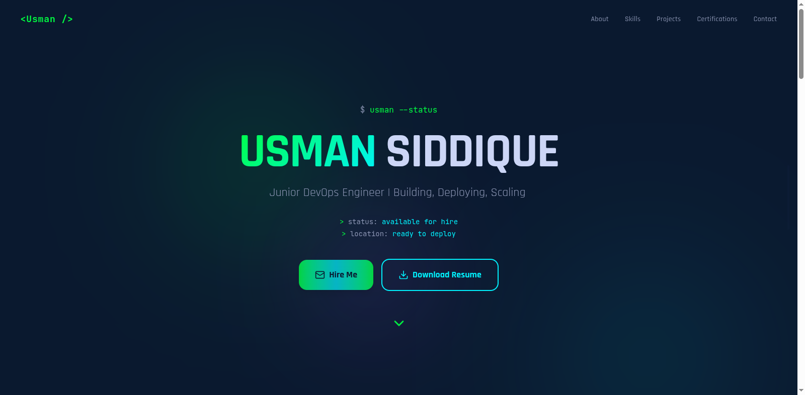
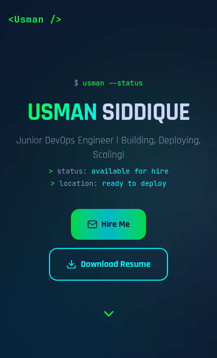

# 🚀 DevOps Portfolio - Usman Siddique

A modern, cyberpunk-themed portfolio website featuring glassmorphism effects, terminal animations, and smooth interactions.

## 📸 Screenshots


*Glassmorphic portfolio with terminal animations*


*Fully responsive on all devices*

> 📷 **Add your screenshots to a `screenshots/` folder**

---

## ✨ Features

- 💚 **Cyberpunk Design** - Terminal-inspired with neon green accents
- 🎨 **Glassmorphism Effects** - Frosted glass cards with backdrop blur
- ⚡ **Smooth Animations** - Typing effects, floating blobs, smooth scrolling
- 📱 **Fully Responsive** - Optimized for desktop, tablet, and mobile
- 🎯 **Interactive Elements** - Hover effects, scroll progress indicator
- 🚀 **Fast Loading** - Optimized performance and clean code

---

## 🛠️ Tech Stack

- **HTML5** - Semantic structure
- **CSS3** - Glassmorphism, animations, Grid/Flexbox
- **JavaScript** - Typing animations, smooth scrolling, interactions
- **No Framework** - Pure vanilla code for maximum performance

---

## 🚀 Quick Start

### Local Development

1. **Clone the repository:**
```bash
git clone https://github.com/myselfusman/devops-portfolio.git
cd devops-portfolio
```

2. **Open in browser:**
```bash
# Simply open the HTML file
open index.html  # macOS
xdg-open index.html  # Linux
start index.html  # Windows

# Or use a local server
python -m http.server 8000  # Then visit http://localhost:8000
```

---

## 📂 Project Structure

```
devops-portfolio/
├── index.html          # Main portfolio page
├── styles.css          # All styling (optional separate file)
├── script.js           # JavaScript animations (optional separate file)
├── assets/             # Images and files
│   └── profile.jpg     # Your profile photo
└── README.md           # This file
```

---

## 🎨 Customization

### Update Your Information

Edit the HTML file to add your own content:

**Profile Section:**
```html
<!-- Update name and tagline -->
<h1>YOUR NAME</h1>
<p>Your Role | Your Tagline</p>
```

**Skills Section:**
```javascript
// Update skills array
const currentSkills = ['Docker', 'Jenkins', 'AWS', 'Git', 'CI/CD'];
const learningSkills = ['Kubernetes', 'Terraform', 'Ansible'];
```

**Projects:**
```html
<!-- Update project cards with your projects -->
<div class="project-card">
  <h3>Your Project Name</h3>
  <p>Project description...</p>
</div>
```

**Contact Info:**
```html
<!-- Update contact links -->
<a href="mailto:your-email@example.com">Email</a>
<a href="https://linkedin.com/in/your-profile">LinkedIn</a>
<a href="https://github.com/your-username">GitHub</a>
```

### Change Colors

All colors are defined in CSS variables:

```css
:root {
  --bg-dark: #0A192F;
  --primary-green: #00FF41;
  --secondary-cyan: #00F3FF;
  --text-primary: #CCD6F6;
}
```

---

## 🌐 Deployment

### Deploy to GitHub Pages

1. **Push to GitHub:**
```bash
git add .
git commit -m "Initial commit"
git push origin main
```

2. **Enable GitHub Pages:**
   - Go to **Settings** → **Pages**
   - Source: **Deploy from branch main**
   - Save and wait 2-3 minutes

3. **Visit:** `https://yourusername.github.io/devops-portfolio`

### Deploy to Netlify

1. Drag your project folder to [Netlify Drop](https://app.netlify.com/drop)
2. Done! Get instant URL

### Deploy to Vercel

```bash
npm i -g vercel
vercel
```

### Deploy to EC2 / VPS

1. **Upload files:**
```bash
scp -r * user@your-server:/var/www/html/
```

2. **Configure Nginx:**
```nginx
server {
    listen 80;
    server_name your-domain.com;
    root /var/www/html;
    index index.html;
}
```

3. **Restart Nginx:**
```bash
sudo systemctl restart nginx
```

---

## 👨‍💻 About

**Usman Siddique**  
Junior DevOps Engineer | Building, Deploying, Scaling

- 📧 Email: [contact@myselfusman.com](mailto:contact@myselfusman.com)
- 💼 LinkedIn: [linkedin.com/in/myself-usman](https://www.linkedin.com/in/myself-usman/)
- 🐙 GitHub: [github.com/myselfusman](https://github.com/myselfusman)

---

## 📄 License

This project is open source and available under the [MIT License](LICENSE).

---

## 🙏 Acknowledgments

- Inspired by terminal aesthetics and cyberpunk design
- Glassmorphism effects inspired by iOS design
- Color scheme: Matrix green + modern cyan accents

---

<div align="center">

**Built with 💚 by Usman Siddique**

⚡ *Automate everything, deploy with confidence, scale infinitely* ⚡

</div>
